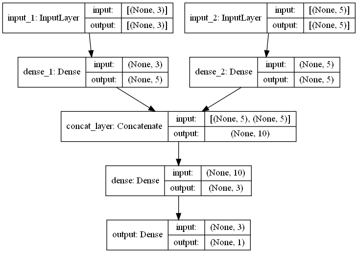

# Model Layer Extractor via Tensorflow APIs 🔆
- This repository shows split and extracting a part layer in the DNN model using Tensorflow
- Since Tensorflow has API like bellow, this repository will focus on `Functional API`, `Sub Classing API` and `Sub Classing API With Custom Layer`
    - Functional API
        - https://www.tensorflow.org/guide/keras/functional
    - Sequencial API
        - https://www.tensorflow.org/guide/keras/sequential_model
    - Sub Classing API
        - https://www.tensorflow.org/guide/keras/custom_layers_and_models
- All API is built-in like bellow and will extract from Input 1 to dense_1 output


# Usage ⌚
- Install [poetry](https://github.com/python-poetry/poetry) and [Makefile](http://gnuwin32.sourceforge.net/packages/make.htm) before running codes

## Import dependencies
```bash
make install
```

## Run code formatter
```bash
make format
```

## Run extractor code
```bash
make run
```

### Result of extractor
- Each extract result from each APIs shows the same vector
```bash
PS A:\ドキュメント\TensorflowModelSplitter> make run
poetry run python -m tensorflowmodelsplitter
2021-09-20 14:33:57.325231: I tensorflow/stream_executor/platform/default/dso_loader.cc:49] Successfully opened dynamic library cudart64_110.dll
2021-09-20 14:33:59.094355: I tensorflow/compiler/jit/xla_cpu_device.cc:41] Not creating XLA devices, tf_xla_enable_xla_devices not set
2021-09-20 14:33:59.095254: I tensorflow/stream_executor/platform/default/dso_loader.cc:49] Successfully opened dynamic library nvcuda.dll
2021-09-20 14:33:59.125741: I tensorflow/core/common_runtime/gpu/gpu_device.cc:1720] Found device 0 with properties: 
pciBusID: 0000:0c:00.0 name: NVIDIA GeForce RTX 3090 computeCapability: 8.6
coreClock: 1.785GHz coreCount: 82 deviceMemorySize: 24.00GiB deviceMemoryBandwidth: 871.81GiB/s
2021-09-20 14:33:59.126229: I tensorflow/stream_executor/platform/default/dso_loader.cc:49] Successfully opened dynamic library cudart64_110.dll
2021-09-20 14:33:59.132765: I tensorflow/stream_executor/platform/default/dso_loader.cc:49] Successfully opened dynamic library cublas64_11.dll
2021-09-20 14:33:59.132939: I tensorflow/stream_executor/platform/default/dso_loader.cc:49] Successfully opened dynamic library cublasLt64_11.dll
2021-09-20 14:33:59.136376: I tensorflow/stream_executor/platform/default/dso_loader.cc:49] Successfully opened dynamic library cufft64_10.dll
2021-09-20 14:33:59.137638: I tensorflow/stream_executor/platform/default/dso_loader.cc:49] Successfully opened dynamic library curand64_10.dll
2021-09-20 14:33:59.145378: I tensorflow/stream_executor/platform/default/dso_loader.cc:49] Successfully opened dynamic library cusolver64_10.dll
2021-09-20 14:33:59.148579: I tensorflow/stream_executor/platform/default/dso_loader.cc:49] Successfully opened dynamic library cusparse64_11.dll
2021-09-20 14:33:59.149387: I tensorflow/stream_executor/platform/default/dso_loader.cc:49] Successfully opened dynamic library cudnn64_8.dll
2021-09-20 14:33:59.149684: I tensorflow/core/common_runtime/gpu/gpu_device.cc:1862] Adding visible gpu devices: 0
2021-09-20 14:33:59.150134: I tensorflow/core/platform/cpu_feature_guard.cc:142] This TensorFlow binary is optimized with oneAPI Deep Neural Network Library (oneDNN) to use the following CPU instructions in performance-critical operations:  AVX2
To enable them in other operations, rebuild TensorFlow with the appropriate compiler flags.
2021-09-20 14:33:59.152406: I tensorflow/core/common_runtime/gpu/gpu_device.cc:1720] Found device 0 with properties: 
pciBusID: 0000:0c:00.0 name: NVIDIA GeForce RTX 3090 computeCapability: 8.6
coreClock: 1.785GHz coreCount: 82 deviceMemorySize: 24.00GiB deviceMemoryBandwidth: 871.81GiB/s
2021-09-20 14:33:59.152727: I tensorflow/stream_executor/platform/default/dso_loader.cc:49] Successfully opened dynamic library cudart64_110.dll
2021-09-20 14:33:59.152906: I tensorflow/stream_executor/platform/default/dso_loader.cc:49] Successfully opened dynamic library cublas64_11.dll
2021-09-20 14:33:59.153065: I tensorflow/stream_executor/platform/default/dso_loader.cc:49] Successfully opened dynamic library cublasLt64_11.dll
2021-09-20 14:33:59.153215: I tensorflow/stream_executor/platform/default/dso_loader.cc:49] Successfully opened dynamic library cufft64_10.dll
2021-09-20 14:33:59.153344: I tensorflow/stream_executor/platform/default/dso_loader.cc:49] Successfully opened dynamic library curand64_10.dll
2021-09-20 14:33:59.153491: I tensorflow/stream_executor/platform/default/dso_loader.cc:49] Successfully opened dynamic library cusolver64_10.dll
2021-09-20 14:33:59.153661: I tensorflow/stream_executor/platform/default/dso_loader.cc:49] Successfully opened dynamic library cusparse64_11.dll
2021-09-20 14:33:59.153834: I tensorflow/stream_executor/platform/default/dso_loader.cc:49] Successfully opened dynamic library cudnn64_8.dll
2021-09-20 14:33:59.154041: I tensorflow/core/common_runtime/gpu/gpu_device.cc:1862] Adding visible gpu devices: 0
2021-09-20 14:33:59.645983: I tensorflow/core/common_runtime/gpu/gpu_device.cc:1261] Device interconnect StreamExecutor with strength 1 edge matrix:
2021-09-20 14:33:59.646209: I tensorflow/core/common_runtime/gpu/gpu_device.cc:1267]      0 
2021-09-20 14:33:59.646482: I tensorflow/core/common_runtime/gpu/gpu_device.cc:1280] 0:   N
2021-09-20 14:33:59.646823: I tensorflow/core/common_runtime/gpu/gpu_device.cc:1406] Created TensorFlow device (/job:localhost/replica:0/task:0/device:GPU:0 with 21821 MB memory) -> physical GPU (device: 0, name: NVIDIA 
GeForce RTX 3090, pci bus id: 0000:0c:00.0, compute capability: 8.6)
2021-09-20 14:33:59.648413: I tensorflow/compiler/jit/xla_gpu_device.cc:99] Not creating XLA devices, tf_xla_enable_xla_devices not set
Model: "model_1"
_________________________________________________________________
Layer (type)                 Output Shape              Param #
=================================================================
input_1 (InputLayer)         [(None, 3)]               0
_________________________________________________________________
dense_1 (Dense)              (None, 5)                 20
=================================================================
Total params: 20
Trainable params: 20
Non-trainable params: 0
_________________________________________________________________
2021-09-20 14:34:00.397731: I tensorflow/compiler/mlir/mlir_graph_optimization_pass.cc:116] None of the MLIR optimization passes are enabled (registered 2)
2021-09-20 14:34:00.462771: I tensorflow/stream_executor/platform/default/dso_loader.cc:49] Successfully opened dynamic library cublas64_11.dll
2021-09-20 14:34:01.059572: I tensorflow/stream_executor/platform/default/dso_loader.cc:49] Successfully opened dynamic library cublasLt64_11.dll
2021-09-20 14:34:01.064030: I tensorflow/stream_executor/cuda/cuda_blas.cc:1838] TensorFloat-32 will be used for the matrix multiplication. This will only be logged once.
[[ 1.26        0.5508896   1.1130893  -0.12775236 -0.92420477]]
Model: "model_1"
_________________________________________________________________
Layer (type)                 Output Shape              Param #
=================================================================
input_1 (InputLayer)         [(None, 3)]               0
_________________________________________________________________
dense_1 (Dense)              (None, 5)                 20
=================================================================
Total params: 20
Trainable params: 20
Non-trainable params: 0
_________________________________________________________________
[[ 1.26        0.5508896   1.1130893  -0.12775236 -0.92420477]]
Model: "model_1"
_________________________________________________________________
Layer (type)                 Output Shape              Param #
=================================================================
input_1 (InputLayer)         [(None, 3)]               0
_________________________________________________________________
dense_1 (DenseLayer)         (None, 5)                 20
=================================================================
Total params: 20
Trainable params: 20
Non-trainable params: 0
_________________________________________________________________
[[ 1.26        0.5508896   1.1130893  -0.12775236 -0.92420477]]
```

# Author 🌈
- Github: https://github.com/Collonville
- Twitter : https://twitter.com/Collonville